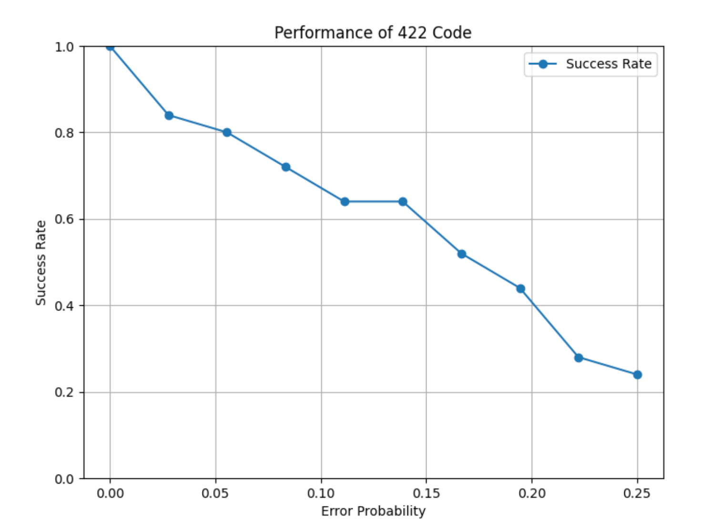

# Experiments to run and their results

# Running experiments:
In the `experiments.py` define the properties of the experiment to be run and then add it to a list and run it from main.
By calling the `run_experiments` function inside of run_experiments.py

This will call `qecc_experiment` function from framework.py which will automatically run the experiments
with the given properites.

## Experiments methodology - How do we run the experiments?

### Theoretical computation of the success rate of the code

First, we establish a theoretical curve that represents the success rate of the code as a function of the error probability.

Thus, we know what we should expect from our simulation/ what pattern we should see in the results.

### Assumptions made:

- We only consider errors belonging to the Pauli group. (X, Y, Z)
- We only consider errors within a Noisy Channel, that is situated between the encoding and decoding of any code.
As that is the place where in theory most operations would be made during an actual algorithm.
- We consider the error probability to be the same for all qubits.
- We consider the error probability to be the same for all types of errors. (X, Y, Z)
- We consider that any qubit can suffer from at most one error.

## [[4, 2, 2]] code 

Theoretical expectation of the success rate as a function of the error probability:

From this we can kind of infer that using it would make the error even more probable as the error rate increases. Thus, it is not a usable code.
Yet, from a theoretical perspective it is still interesting to investigate it. As the idea behind it is interesting. It encodes two qubits at the same time.
And it is one of the smallest codes that you can use. 

Let's see how it performs in practice by running some experiments. 

What we want to investigate is the following: 
- At what error rate does the code starts to be totally unusable on average?

- [] Run experiment to ch

## Steane code  [[7, 1, 3]]

Theoretical expectation of the success rate as a function of the error probability:

## Laflamme code [[5, 1, 3]]

Theoretical expectation of the success rate as a function of the error probability:

