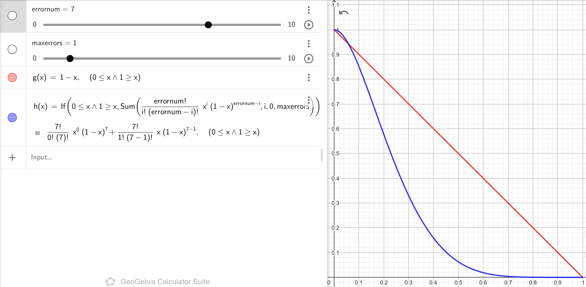

# Experiments to run and their results

## Running experiments:
In the `experiments.py` define the properties of the experiment to be run and then add it to a list and run it from main.
By calling the `run_experiments` function inside of run_experiments.py

This will call `qecc_experiment` function from framework.py which will automatically run the experiments
with the given properites.


# Experiments methodology - How do we run the experiments?

## Theoretical computation of the success rate of the code

First, we establish a theoretical curve that represents the success rate of the code as a function of the error probability.


Brief explanation:
- `errornum` - number of errors that we can encounter == number of qubits in the code
- `maxerrors` - maximum number of errors that can be correct => we can get to the correct result by correcting them
- `g(x) = 1-x` - probability of error in physical qubit
- `h(x)` - computes all the possible ways in which we can get `maxerrors` errors in `errornum` qubits and then correct them, getting the right result

\


This is one such curve. What it means ?
- The `x-axis` represents the error probability. 
- The `y-axis` represents the success rate of the code.
- The `blue line` is the theoretical curve that we compute using the formula above.
- The `red line` is the success rate of a physical qubit. (1 - error probability, since we have no correction)
- `Interesction point` is the point at which a logical qubit encoded using the code performs the same as a physical qubit.


Therefore, with this theoretical value we know what we should expect from our simulation/ what pattern we should observe in the results.

## Assumptions made about errors:

- We only consider `errors` belonging to the `Pauli group. (X, Y, Z)`
- We only consider errors within a `Noisy Channel`, that is situated `between the encoding and decoding` of any code.
As that is the place where, in theory, most operations would be made during an actual algorithm.
- We consider the `error probability` to be the `same for all qubits`.
- We consider the `error probability` to be the `same for all types of errors.` (X, Y, Z)
- We consider that `any qubit can suffer from at most one error.`

## Experiment methodology:

For each experiment that we'll run we define the following properties:


- `experiment_type` - the `code` that `we want to test`
- `base_errors` - initial assumptions about errors
    - `target_qubits` - the qubits that can be affected by errors
    - `error_probability` - the probability of an error occuring for each type of error
- `runs_count` - the number of time we create the circuit and run it (*extra explanation below)
- `error_types` - specifies what types of errors we want to modify during the experiment
- `error_range` - the range of error probabilities that we want to test
- `number_of_samples` - the amount of equally spaced points in the `error_range` that define the error probabilities that we want to test. (e.g range = (0, 0.1), number_of_samples = 3 => we take three points 0, 0.05, 0.1 and run experiments for each of them)
- `shots` - amount of times we repeat an experiment with the same circuit
- `expected_state` - the state that we expect to get as result
- `experiment_path` - where we want to save the results of the experiment 


\
**Explanation of `runs_count`**:

- We want to `generate the circuit multiple times with a certain error probability` (as each time it is generated it can get different types of errors within the `Noisy channel`) and then run it multiple times to get a more accurate result. Thus geting a `meaningful average of the success rate of the code for that error probability.` 

Once this properites are defined, we can run the experiments automatically. Below is the code that runs one such experiment given the properites defined above (some parts are omitted for brevity).

```python
def qecc_experiment(backend, experiment_properties):

    ##### unpacking experiment_properites - prologue #####
    
    # take number_of_samples equally spaced values from the error_range interval 
    error_probabilities = np.linspace(error_range[0], error_range[1], number_of_samples)

    success_rates = []

    for error_probability in error_probabilities:
        current_errors = base_errors.copy()  # reset errors to base errors
        
        for error_type in error_types:
            if error_type in current_errors["error_probs"]:
                current_errors["error_probs"][error_type] = error_probability # update error probability for each type of error

        success_count = 0

        for i in range(runs_count):

            #### define experiment_name ####
            
            # run the experiment
            results = EXPERIMENT_TYPE[experiment_type](backend, experiment_type, experiment_name, current_errors, shots) 

            if results['deduced_state'] == expected_state:
                success_count += 1 

        success_rate = success_count / runs_count
        success_rates.append(success_rate)

        print(f"Error Probability: {error_probability:.2f}, Success Rate: {success_rate:.2%}")

    experiment_name = f"{experiment_type}"
    save_experiment_plot(error_probabilities, success_rates, experiment_name, experiment_path)
```

During the run of the experiment, the results of each individual experiment will be compared to the `expected_state` and the success rate of the code will be computed `for each error probability`. 

Then, the results will be plotted using matplotlib and saved in the `circuits/{experiment_path}` folder locally. 

The plot will contain the theoretical curve, the success rate of the physical qubit and the success rate of the code as a function of the error probability.

The framework defined for running the experiments is flexible and can be easily extended to run more experiments with different properties.


# [[4, 2, 2]] code 

Theoretical expectation of the success rate as a function of the error probability:


From this we can kind of infer that using it would make the error even more probable as the error rate increases. Thus, it is not a usable code.
Yet, from a theoretical perspective it is still interesting to investigate it. As the idea behind it is interesting. It encodes two qubits at the same time.
And it is one of the smallest codes that you can use. 

Let's see how it performs in practice by running some experiments. 

What we want to investigate is the following: 
- [x] How does the `success rate of the code` change as the error probability of `bit flips` increases?


- [x] How does the `success rate of the code` change as the error probability of `phase flips` increases?


- [x] How does the `success rate of the code` change as the error probability of `bit and phase flips` increases?


As can be seen from the plots, the theoretical model is totaly accurate.


# Steane code  [[7, 1, 3]]

Theoretical expectation of the success rate as a function of the error probability:



# Laflamme code [[5, 1, 3]]

Theoretical expectation of the success rate as a function of the error probability:

