# Deutsch's algorithm using 422 encoding

## How Deutsch's algorithm look like (2 qubits)

Below is the general circuit for Deutsch's algorithm, using 2 qubits. As you can see you begin from a `|01>` state, apply a `hadamard transform`(hadamard on all qubits) then you pass your qubits through an oracle that is able to simulate any function `f(x)`. and at the end you hadamard the first qubit and then measure it.

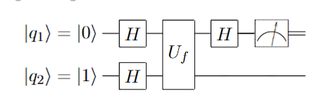

The algorithm is meant to tell wheter a given function is constant or balanced. In the case of a constant function, the output will be 0, and in the case of a balanced function, the output will be 1. 

Now, let's look at the 4 possible functions that we can analyze, mroe specifically at how the oracle would look for each of them. See below.
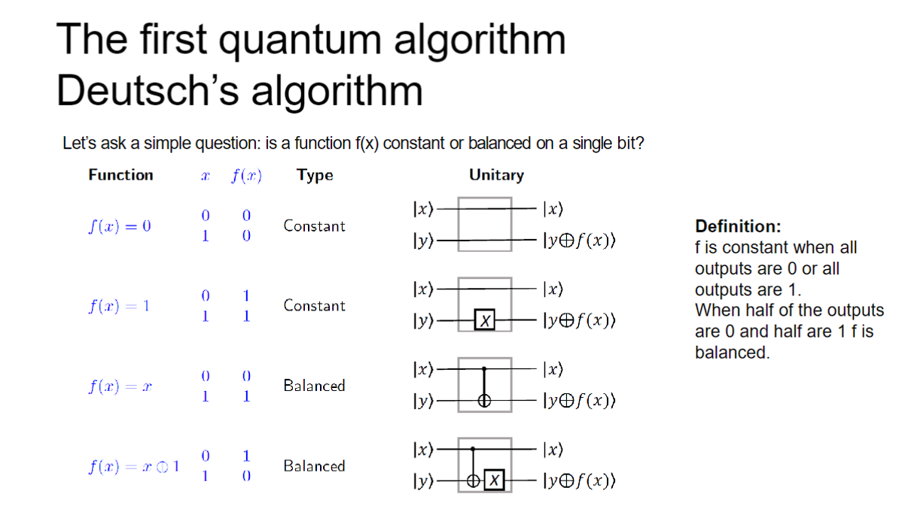

## [[4,2,2]] encoding

4 physical qubits, 2 logical qubits, 2 ancilla qubits. The logical qubits are encoded in the physical qubits in the following way:

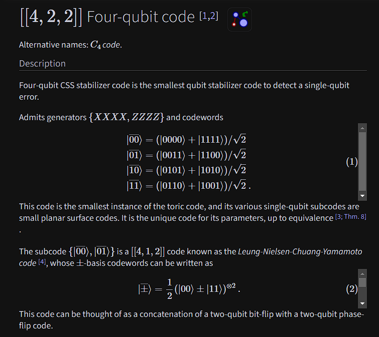

Soo, we use the stabilizers to define a space with only 4 states that are valid, and use those four states to encode two logical qubits. pretty neat, right?

Looking now at the circuit:

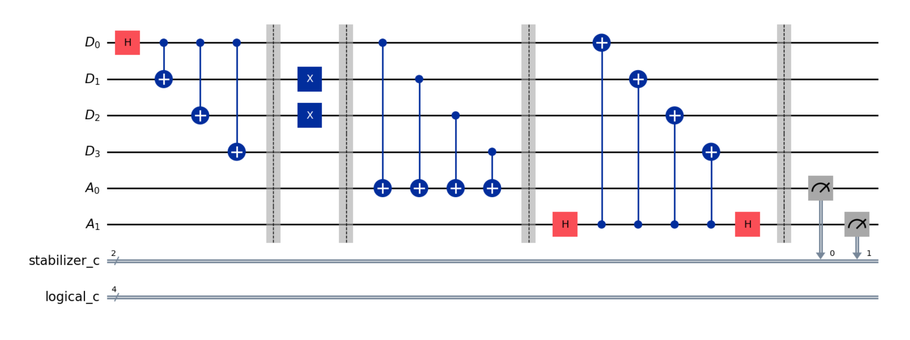
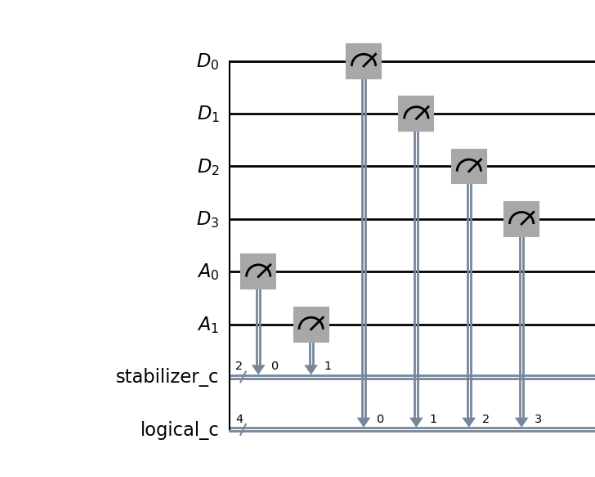

What happens in this circuit is as follows:
- we get to encode to the logical `|00>` state. More explicitly, in the first part, a hadamard gets us a `|+>` in the first qubit, and CX gates "copy" the state to the others qubits.
- then we use a little trick to get to the |10> state (by observing what qubits need to be flipped when going from logical |00> to |10> )
- we then apply the `X_stabilizers` and store the result in an ancilla qubit
- we then apply the `Z_stabilizers` and store the result in another ancilla qubit
- we measure the ancilla qubits and then we measure the data qubits

This is pretty nice, what is even nicer that the result of stabilizers tell us whether there was an error or not in the circuit at any point.

And the data qubits that were measured will be in one of the 8 possible states from here : 
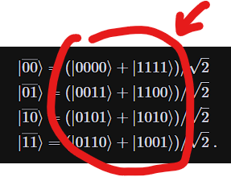

Since they are all different, we can determine what was the logical state that they were encoding.
Performing multiple experiments means that we expect to see a histogram as below:
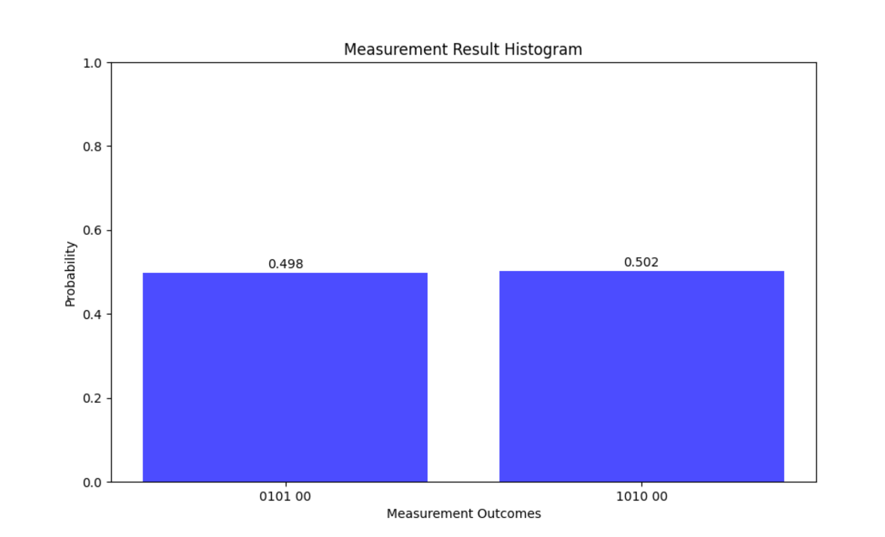

Basically the measurement collapses with equal probability in one of the states that encode a superposition, as you can see from the first four qubits. This result can be interpreted as the logical state |10> as you can see from the previous description of the states.

The last two qubits being 00, means that both the stabilizers got an output of 0, meaning there was either no error, or there was an error that can be missinterpreted as a logical operator. (changes the state into another valid state).

Now, let's get to the fun part: Deutsch's algorithm using the [[4,2,2]] encoding.

## Notes on how the logical gates work like in [[4,2,2]]
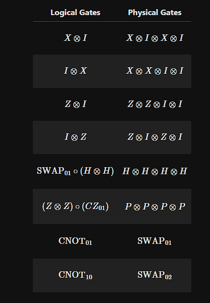
done, this are the notes =))

## Implementing Deutsch's algorithm using [[4,2,2]] encoding

In a really nice world, maybe even call it ideal, we would get exactly what we would expect: 

- `f(x) = 0` would return `0` (constant function)

This is the circuit for it, suing the 422 encoding and logical operators.
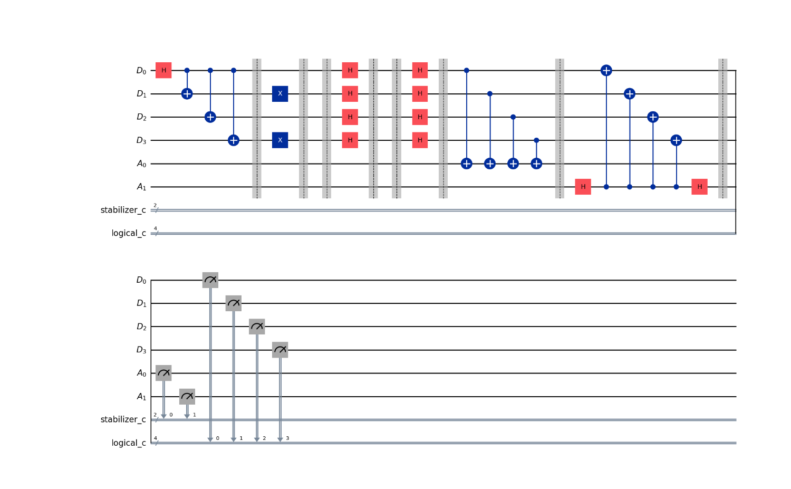

The circuit was made in an interesting manner: 
- The first part is to initialize in the logical |00> state, as previously described.
- The second part is used as a trick to go in the |10> state (when doing deutch's algorithm you want the first qubit to be in the |0> state and the second qubit to be in the |1> state, as explained above). Yet, in order for the next steps to be closely related to the way we usually go about the algorithm, we needed to do this trick. That is, because when applying a logical H gate in [[4,2,2]] it implicitly does a SWAP between the logical qubits. (it will all make sense when seeing the drawing below, abstracting the not that nice parts of what happens)
- Now we have logical state |10>. we are good to go!
- We then apply the Hadamard transform on our qubits, yet, it also makes the qubits swap places. Thus, we have the `x` and `y` exactly as in the above diagram about the algorithm.
- Next, the oracle we need to apply for this one is none, haha, all of this just to let the states intact.
- We then have to hadamard transform again, unfortunately this once again flips things, and also kind of destroys the state that we don't measure. (yet, what we want is the result anyways). But you need to keep in mind that since the qubits get flipped then it means that we now want to measure the second qubit. (so, it began as the below one, we did the first H logical gate, it got to the top, to be the `x` we wanted, yet, once we did the last H logical gate, it got to the bottom). I want to stress the order as the result is rather confusing otherwise.
- Since `f(x) = 0` is constant, we expect the result to be 0.

And this would be the results, as got from running the `run_Deutsch_logical_422_qi` function from the `four_two_two_qi` module:

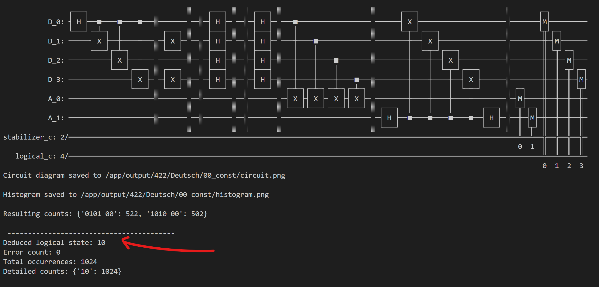
As you can see the result is `0`, as expected, (the second bit is the one we are interested in, as explained above when trying to make sense of the swaping when doing operations).

Here is a step by step abstract way of seeing what happens inside of the above circuit:

.png>)

Yet, real life is not as good as the simulation... when running the same code on the ibm quantum platform... the physical qubits are really noisy and.. well, it's like a coin flip... you get all the possible outputs in equal probability...: (for brevety the huge list of all the bitstrings got as output was omited)

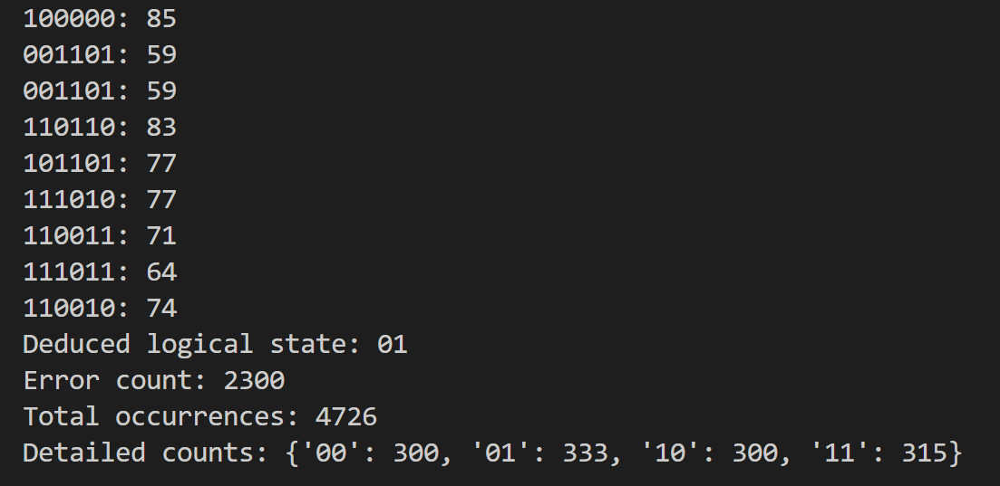

So, as we can see above, running on a real, current quantum computer/processor, is not working that well. The noise is too high, and maybe the amount of operations might also be problematic as well...=(

### Below are the circuits for the other cases: 

- `f(x) = 1` would return `0` (constant function)

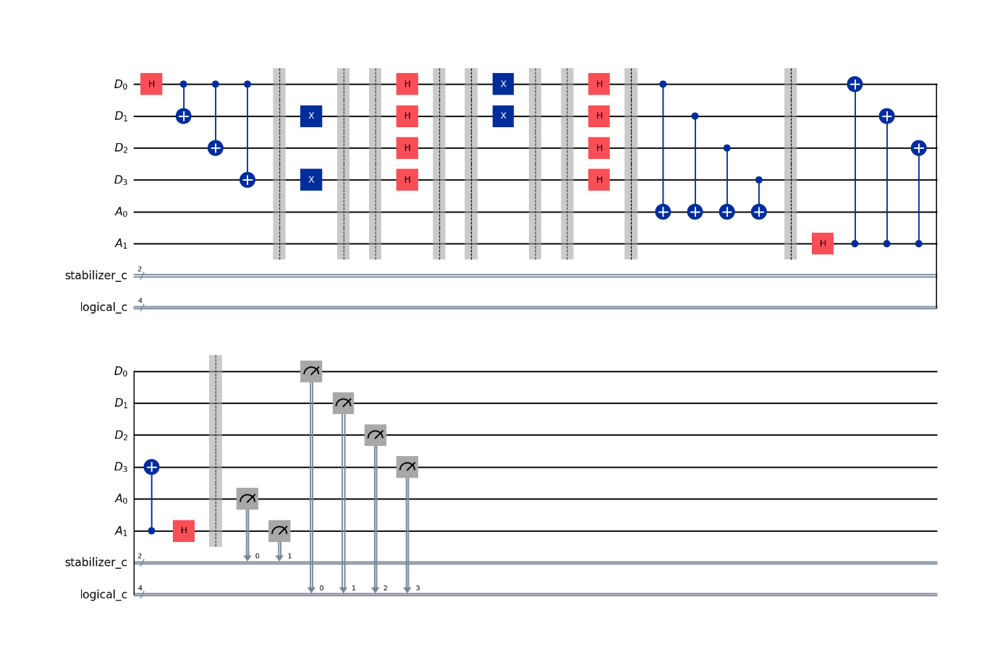

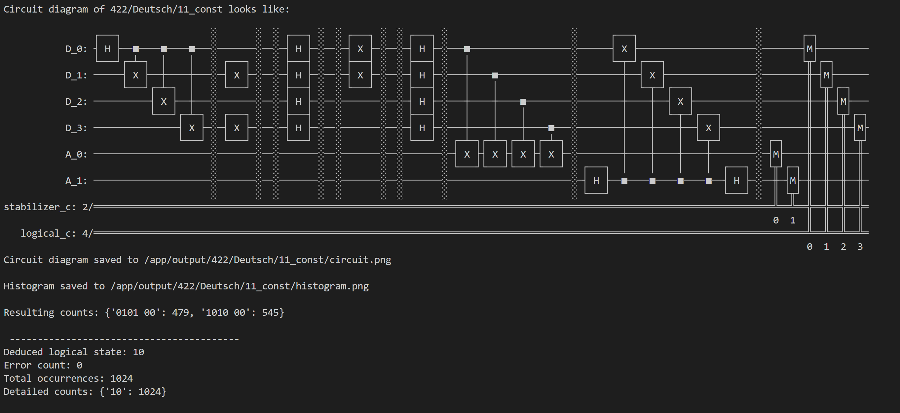

Once again the second bit is 0. 

Also in here, the operation of the oracle is equal to a logical X on the 2nd qubit as can be observed above.

- `f(x) = x` would return `1` (balanced function)

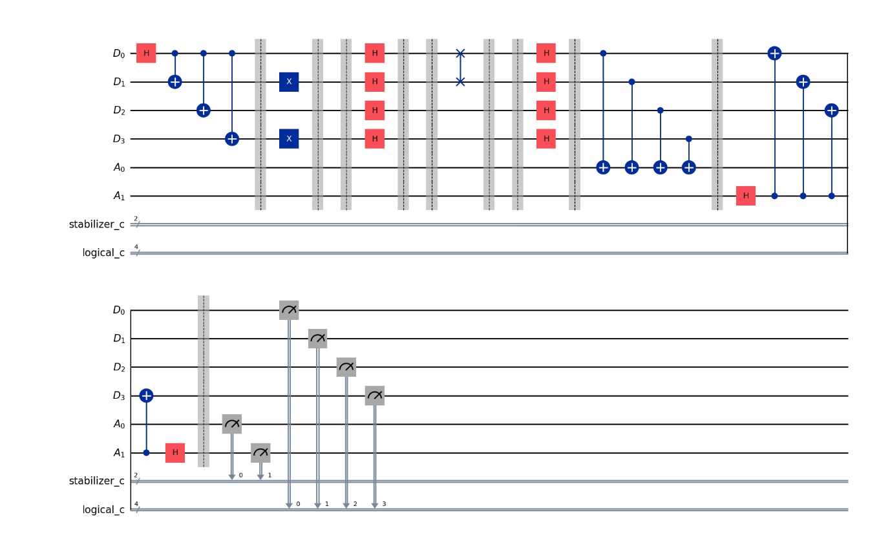

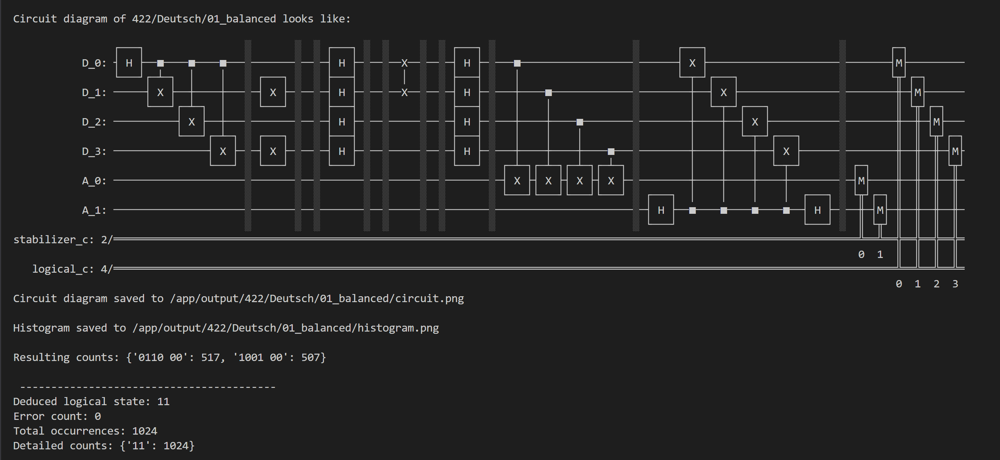

Second bit is 1 => yes, we get balanced as output.

The oracle is now a logical CNOT01, implemented as a SWAP01.

- `f(x) = (x+1) mod 2` would return `1` (balanced function)

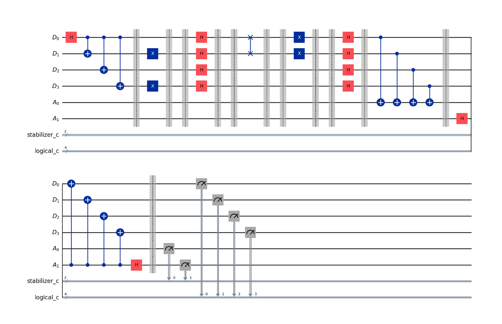

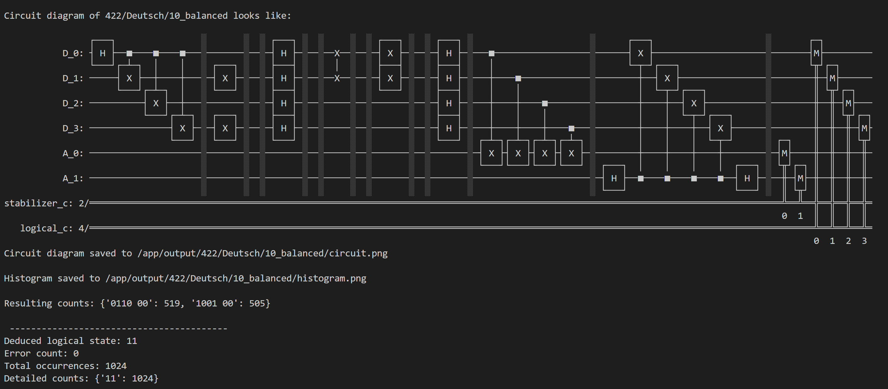

Second bit is 1 => yes, we get balanced as output.

The oracle is now a logical CNOT01, implemented as a SWAP01. Followed by a logical X on the 2nd qubit.

## Conclusion

We were able to implement an algorithm using logical qubits, with logical operators, which is really interesting to see. It is also interesting to understand how the way you apply logical operators might affect the way you think about the algorithm, as it makes it not be that straightforward, as it is when you think about qubits in a more `physical qubit` way. Error detection is also a really nice feature, even though the results of the ibm quantum computer were not that good, we can at least know when we had an error. If the error rates of physical qubits would be lower, then this method might be benefical, as you can tell an error happened an try to rerun the algorithm. Yet, probably we would never get to that low error levels... thus, surface codes might be the way to go, as they are way more scalable and make way more sense.

Implementing the Deutsch algorithm with this encoding was mostly motivated by the ease of working with two qubits, and how the logical operations on them work like.