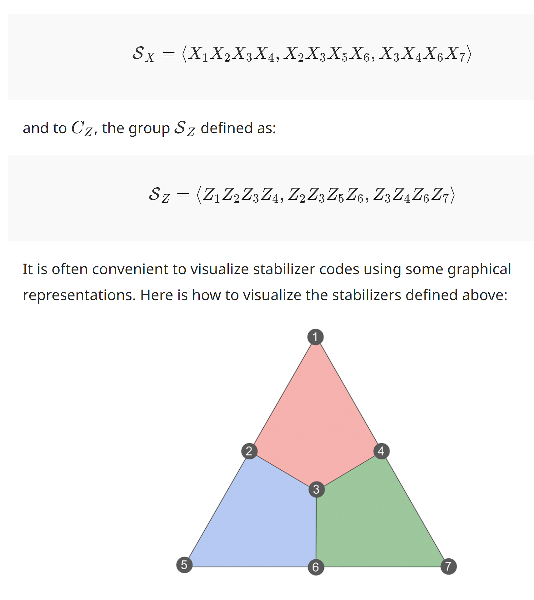

# Basics of Error correction

The general structure of an error correcting code is as follows:

- Encoding - Encode our state using ancilla qubits
- Error - Some errorrs occur
- Stabilizer measurements - Measure the ancilla qubits to detect the errors. This is done by measuring the stabilizers of the code.
- Recovery - Correct the errors by applying the appropriate correction operations.

## Stabilizers

Soo, Stabilizers are an Abelian group meaning they need to comute, thus we want to have even # of X and Z operators intersect (see below more comprehensive explanation). 

Measure all the stabilizers, resulting in what is called the syndrome.

While stabilizers of the same Pauli type necessarily commute, it is not obvious that all the $Z$ stabilizers commute with all the $X$ stabilizers. For this to be the case, each $X$ stabilizer should intersect on an even number of qubits with all the $Z$ stabilizers 

### Steane code - color code

!Note. Furthermore, it only requires the measurement of weight-4 stabilizers, as opposed to Shor’s code which requires measuring weight-6 stabilizers. Since errors can happen during the measurement of stabilizers, a good rule of thumb to get well-performing quantum codes is to always try to minimize the weight of its stabilizer generators.

# Surface codes

## Why would we want to use surface codes ?

So far we have seen many kinds of codes, but most of them were handcrafted, and so a lot of atention needs to be put into making them. Thus:

Some major advantages that this kind of codes also have are:

In general when dealing with surface codes we have to keep in mind the following threshold: (basically, untill when it is still worth it to add even more physical qubits, to get a better error rate)

Fun fact:

## 4-cycle - basic structure behind surface codes
For starters to get used to surface codes we implement the most basic form of one such code, the 4-cycle surface code. This code is defined on a 2D lattice of qubits, where each qubit is connected to its nearest neighbors.  

A better way to understand the same graph:

There are two kinds of qubits that we use in the 4-cycle code:
- Data qubits - These are the qubits that store the information that we want to protect.
- Ancilla qubits - These are the qubits that we use to detect the errors. We measure the stabilizers of the code using these qubits.

This can be seen even better in the below ilustration:

## More general surface codes

Error detection:

Since they anti commute it means that they behave just as for the regular qubit.

!Note. We always want to have an extra degree of freedom, that's why we always have more data qubits than ancilla qubits.

### What is next ?

# References

- Explanation about stabilizers and surface codes basics, with amazing visualizations - https://arthurpesah.me/blog/
- Introductory course with nice visualizations - https://opencourse.inf.ed.ac.uk/sites/default/files/https/opencourse.inf.ed.ac.uk/iqc/2024/iqclecture29_0.pdf
- general introduction into quantum error correcting codes -https://arxiv.org/pdf/1907.11157
- Surface codes *for the mortals* **the best resource** - https://journals.aps.org/pra/abstract/10.1103/PhysRevA.86.032324
- https://en.wikipedia.org/wiki/Centralizer_and_normalizer
- more about logical operators of Steane code - https://abdullahkhalid.com/blog/2022/Nov/01/logical-operations-for-the-steane-code/
- steane qubits problems - https://stem.mitre.org/quantum/error-correction-codes/steane-ecc.html